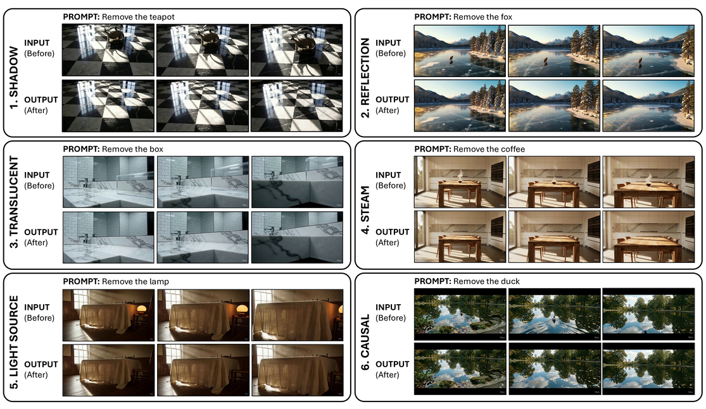

# BeyondMasks: Evaluating Causal and Physical Consistency in Video Object Removal [ECCV 2026]

[Yiğit Ekin](https://yigitekin.github.io/), [Enes Sanli](https://openreview.net/profile?id=~Enes_Sanli1), [Aykut Erdem](https://aykuterdem.github.io/), [Erkut Erdem](https://web.cs.hacettepe.edu.tr/~erkut/), [Aysegul Dundar](https://www.cs.bilkent.edu.tr/~adundar/)

This repository contains the official evaluation code for **BeyondMasks: Evaluating Causal and Physical Consistency in Video Object Removal**, accepted to **ECCV 2026**. BeyondMasks is a benchmark for evaluating whether video object removal methods remove not only the target object, but also its causal and physical after-effects such as shadows, reflections, illumination changes, translucency, steam, and dynamic physical traces.

[](#) [](https://huggingface.co/datasets/yigitekin/BeyondMasks/tree/main) [](#bibtex)

<p align="center">
    
</p>

### **Abstract:**

> Recent advances in generative video models have significantly improved visual realism in video object removal, yet evaluation protocols still focus on masked-region fidelity, treating removal as local inpainting. In real scenes, object removal is a causal intervention: eliminating an object also requires removing its induced physical effects, such as shadows, reflections, illumination changes, translucency, and dynamic traces. Existing benchmarks lack aligned clean references or remain limited to simplified synthetic settings, preventing systematic evaluation of causal consistency. We introduce BeyondMasks, a paired benchmark for causally consistent video object removal, consisting of temporally aligned synthetic and real-world video pairs with clean background references. The dataset spans diverse photometric, geometric, volumetric, and dynamic interactions, and supports both mask-based and instruction-driven editing. We further propose CORE, a structured vision-language model-based evaluation protocol that jointly measures object disappearance and after-effect consistency, aligning more closely with human judgments than existing metrics. Benchmarking state-of-the-art methods reveals systematic failures in removing secondary physical effects despite high masked-region fidelity, exposing a gap between visual plausibility and causal correctness. BeyondMasks reframes video object removal as causal scene consistency rather than local reconstruction and provides a unified framework for its evaluation.

### News

* **BeyondMasks is accepted to ECCV 2026.**
* **Dataset is released on Hugging Face.**
* **CORE evaluation code is released.**

### Cloning the Repository

```bash
git clone git@github.com:YigitEkin/BeyondMasks.git
cd BeyondMasks
```

### Dataset

The BeyondMasks dataset is hosted on Hugging Face:

```text
https://huggingface.co/datasets/yigitekin/BeyondMasks/tree/main
```

The dataset contains temporally aligned video triplets for video object removal evaluation. Each sample consists of:

* an input video where the target object and its physical after-effects are present,
* a clean ground-truth video where the object and after-effects are absent,
* a binary mask video indicating the target object region.

The dataset repository has the following structure:

```text
BeyondMasks/
├── masks/                # Binary mask videos indicating the object to remove
├── object_not_present/   # Ground-truth videos where the object and after-effects are absent
├── objects_added/        # Input videos where the object and after-effects are present
├── data_example.json     # Example metadata format
└── eval.py               # Proposed evaluation metric code
```

The three video folders are aligned by sample id. For example:

```text
masks/1.mp4
object_not_present/1.mp4
objects_added/1.mp4
```

correspond to the same sample.

### Environment Setup

We recommend using [`uv`](https://github.com/astral-sh/uv) for environment setup.

First, install `uv` if it is not already installed:

```bash
curl -LsSf https://astral.sh/uv/install.sh | sh
```

On macOS, you can also install `uv` with Homebrew:

```bash
brew install uv
```

Create a virtual environment:

```bash
uv venv --python 3.10
```

Activate the environment:

```bash
source .venv/bin/activate
```

Install the required dependencies:

```bash
uv pip install -r requirements.txt
```

The provided `requirements.txt` contains:

```text
google-genai
opencv-python-headless
huggingface_hub
```

### Downloading the Dataset

After setting up the environment and installing the requirements, download the dataset with:

```bash
huggingface-cli download yigitekin/BeyondMasks \
  --repo-type dataset \
  --local-dir data/BeyondMasks
```

Alternatively, without activating the environment, you can run the Hugging Face CLI through `uv`:

```bash
uv run --with huggingface_hub huggingface-cli download yigitekin/BeyondMasks \
  --repo-type dataset \
  --local-dir data/BeyondMasks
```

You can also manually download the dataset from:

```text
https://huggingface.co/datasets/yigitekin/BeyondMasks/tree/main
```

### Repository Structure

This GitHub repository contains only the evaluation code and project assets. The dataset videos are hosted separately on Hugging Face.

```text
BeyondMasks/
├── eval.py
├── requirements.txt
├── README.md
├── assets/
│   ├── teaser.pdf
│   └── teaser.png
└── .gitignore
```

### Evaluation

We provide the official implementation of **CORE**: **Causal Object Removal Evaluation**.

CORE evaluates two complementary aspects of video object removal:

| Score                | Description                                                                |
| :------------------- | :------------------------------------------------------------------------- |
| **ObjectScore**      | Measures how completely the target object is removed.                      |
| **AftereffectScore** | Measures how thoroughly object-induced physical after-effects are removed. |

Unlike standard pixel-level metrics, CORE explicitly evaluates whether the edited video is causally consistent with the clean reference video. It checks whether residual object traces, shadows, reflections, illumination changes, translucent effects, steam, or dynamic physical traces remain after removal.

### Evaluation Data Format

The evaluation script expects the following directory structure:

```text
eval_root/
├── objects_added/        # Input videos with object and after-effects present
├── object_not_present/   # Ground-truth videos where the object and after-effects are absent
├── result/               # Method output videos to evaluate
└── data.json             # Metadata annotations
```

The video filenames should be aligned across folders. For example:

```text
eval_root/
├── objects_added/
│   ├── 1.mp4
│   ├── 2.mp4
│   └── ...
├── object_not_present/
│   ├── 1.mp4
│   ├── 2.mp4
│   └── ...
├── result/
│   ├── 1.mp4
│   ├── 2.mp4
│   └── ...
└── data.json
```

Here:

* `objects_added/` contains the original input videos with the target object and after-effects.
* `object_not_present/` contains the clean ground-truth videos where the object and after-effects are absent.
* `result/` contains the output videos generated by the method being evaluated.
* `data.json` contains metadata annotations such as the target object and after-effect type.


### Expected Metadata Format

The metadata file should contain annotation entries for the evaluated videos. The keys should match the expected format in `eval.py`.

Example:

```json
[
  {
    "id": "1",
    "fg_object": "teapot",
    "after_effect_type": "shadow"
  },
  {
    "id": "2",
    "fg_object": "fox",
    "after_effect_type": "reflection"
  }
]
```

The `id` field should match the corresponding video filenames in `objects_added/`, `object_not_present/`, and `result/`.

The `after_effect_type` field can also be a list when a sample contains multiple after-effect categories:

```json
[
  {
    "id": "3",
    "fg_object": "lamp",
    "after_effect_type": ["light source", "shadow"]
  }
]
```

### Preparing Method Outputs

To evaluate your own video object removal method, place your generated videos under:

```text
eval_root/result/
```

Make sure that the filenames match the corresponding input and ground-truth videos. For example, if the input video is:

```text
eval_root/fg/12.mp4
```

and the ground-truth video is:

```text
eval_root/bg/12.mp4
```

then your method output should be:

```text
eval_root/result/12.mp4
```

The script also supports result files ending with `_remove`. For example:

```text
eval_root/result/12_remove.mp4
```

will be matched with sample id `12`.

### Running CORE

CORE uses Gemini as a vision-language model judge. Before running the evaluation script, set your Gemini API key:

```bash
export GEMINI_API_KEY=your_api_key
```

Then run:

```bash
python eval.py --root /path/to/eval_root
```

For example:

```bash
python eval.py --root ./eval_root
```


The evaluation results will be saved to:

```text
eval_root/core_evaluation_results.json
```

During evaluation, videos are resized to 720×480 before being sent to Gemini. Intermediate preprocessed videos are stored under:

```text
eval_root/_preproc_720x480/
```

### Supported Video Formats

The evaluation script supports the following video extensions:

```text
.mp4, .mov, .avi, .mkv, .webm
```

### Output Format

The output file `core_evaluation_results.json` contains one record per evaluated sample. Each record includes the sample id, foreground object, after-effect type, video paths, CORE scores, raw model output, and status.

Example output entry:

```json
{
  "id": "1",
  "fg_object": "teapot",
  "after_effects": "shadow",
  "fg_video": "eval_root/fg/1.mp4",
  "bg_video": "eval_root/bg/1.mp4",
  "result_video": "eval_root/result/1.mp4",
  "ObjectScore": 5,
  "AftereffectScore": 4,
  "model_output": "Reasoning:\nStep 1: ...",
  "status": "ok"
}
```

If a sample fails during evaluation, the output entry will include:

```json
{
  "id": "1",
  "status": "error",
  "error": "error message"
}
```

The script is resumable. If `core_evaluation_results.json` already contains successful records, those sample ids are skipped in later runs.

### After-Effect Categories

BeyondMasks evaluates several types of object-induced causal and physical after-effects:

| Category                    | Description                                                                                  |
| :-------------------------- | :------------------------------------------------------------------------------------------- |
| **Shadow**                  | Cast shadows and local radiance changes caused by the object.                                |
| **Reflection**              | Direct or indirect object appearance on mirrors, glass, water, or other reflective surfaces. |
| **Translucent**             | Effects caused by semi-transparent or refractive objects.                                    |
| **Steam / Scattering**      | Volumetric traces such as steam, smoke, or diffuse scattering.                               |
| **Light Source**            | Illumination changes caused by emissive objects.                                             |
| **Causal Physical Effects** | Dynamic traces such as ripples, footprints, displaced objects, or surface deformation.       |

### License

The BeyondMasks dataset is released under the **CC BY 4.0** license.

Please refer to the Hugging Face dataset page for dataset licensing details:

```text
https://huggingface.co/datasets/yigitekin/BeyondMasks/tree/main
```

### Acknowledgement

This work was partly supported by the KUIS AI Center Research Awards and the TÜBİTAK-2247-A Program. We thank all reviewers for their valuable comments.

### BibTeX

```bibtex
@misc{ekin2026beyondmasksevaluatingcausalphysical,
      title={BeyondMasks: Evaluating Causal and Physical Consistency in Video Object Removal}, 
      author={Yigit Ekin and Enes Sanli and Aykut Erdem and Erkut Erdem and Aysegul Dundar},
      year={2026},
      eprint={2608.20107},
      archivePrefix={arXiv},
      primaryClass={cs.CV},
      url={https://arxiv.org/abs/2608.20107}, 
}
```
